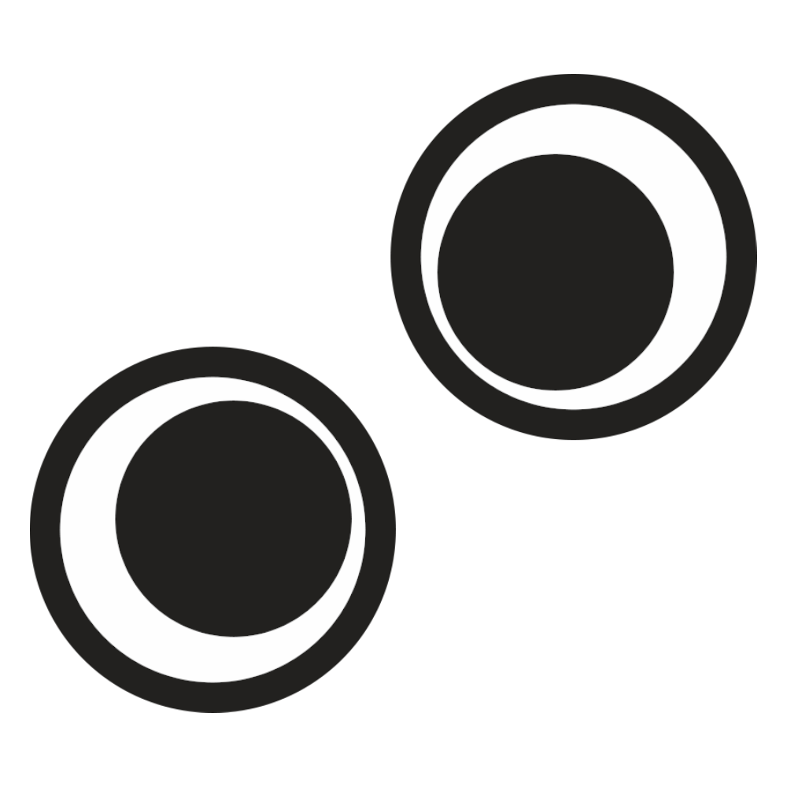

<div id="top"></div>

<!-- PROJECT SHIELDS -->
<!--
*** I'm using markdown "reference style" links for readability.
*** Reference links are enclosed in brackets [ ] instead of parentheses ( ).
*** See the bottom of this document for the declaration of the reference variables
*** for contributors-url, forks-url, etc. This is an optional, concise syntax you may use.
*** https://www.markdownguide.org/basic-syntax/#reference-style-links
-->


<!-- PROJECT LOGO -->
<br />
<div align="center">



<h3 align="center">GestureVerse</h3>

<p align="center">Choose-your-own-adventure Game using Hand Gesture Classification and Detection</p>

  <p align="center">
    <br />
    <a href="#">View Demo</a>
    ·
    <a href="https://github.com/LynnHaDo/Storytelling/issues">Report Bug</a>
    ·
    <a href="https://github.com/LynnHaDo/Storytelling/issues">Request Feature</a>
  </p>
</div>

<!-- TABLE OF CONTENTS -->
<details>
  <summary>Table of Contents</summary>
  <ol>
    <li>
      <a href="#wireframes">Wireframes</a>
    </li>
    <li>
      <a href="#about-the-project">About The Project</a>
      <ul>
        <li><a href="#features">Features</a></li>
        <li><a href="#built-with">Built With</a></li>
      </ul>
    </li>
    <li>
      <a href="#getting-started">Getting Started</a>
      <ul>
        <li><a href="#prerequisites">Prerequisites</a></li>
        <li><a href="#installation">Installation</a></li>
      </ul>
    </li>
    <li><a href="#works-cited">Works Cited</a></li>
    <li><a href="#contact">Contact</a></li>
  </ol>
</details>

<!-- UPDATES -->
## Wireframes

Link to the [wireframes](https://www.figma.com/design/YQvqcC4Nai3QUIconlEFeb/Storytelling?node-id=0-1&t=OQhAFbBnOXiOuGFn-1) for the website.

<!-- ABOUT THE PROJECT -->
## About The Project

This is a web application that guides users through a choose-your-own-adventure game using Windrift. During the game, instead of inputting text or clicking on buttons to proceed like usual, users can interact using hand movements through the devices’ web camera to answer questions prompted on the screen. For example, a thumbs-up gesture would mean “yes”, and a thumbs-down gesture would mean “no”. Handedness (i.e. left or right hand) can also be used to provide input to questions, depending on the story chosen.

Depending on the progress of the project, various stories can be chosen to suit various interests. Stories can range from solving (computer science) challenges to earn the maximum points and unlock new levels, to going through a set of questions to identify your personality test. 

<p align="right">(<a href="#top">back to top</a>)</p>

### Progress

- [x] Wireframes
- [x] Set up game in Windrift
- [x] Integrate MediaPipe
    - [x] Set up MediaPipe component to listen to events of the story
    - [ ] Refactor instructions and camera into a component (called game block)
    - [ ] Set up game blocks to listen to each other
    - [ ] Enhance the UI
        - [ ] Add animations 
- [ ] Set up game in Bitsy
    - [ ] Set up MediaPipe component to interact with events of the game

 

See the [open issues](https://github.com/LynnHaDo/Storytelling/issues) for a full list of proposed features (and known issues).

<p align="right">(<a href="#top">back to top</a>)</p>

### Built With

<p align="right">(<a href="#top">back to top</a>)</p>

<!-- GETTING STARTED -->
### Prerequisites

### Installation

1. Clone the repo

```
git clone https://github.com/LynnHaDo/GestureVerse.git
```

According to the Windrift instructions:

2. Install a fully-compaticble version of Node:

```
nvm install 18
nvm use 18
```

3. Install packages

```
npm install
```

4. Run the local development environment

```
npm run dev
```

<p align="right">(<a href="#top">back to top</a>)</p>


